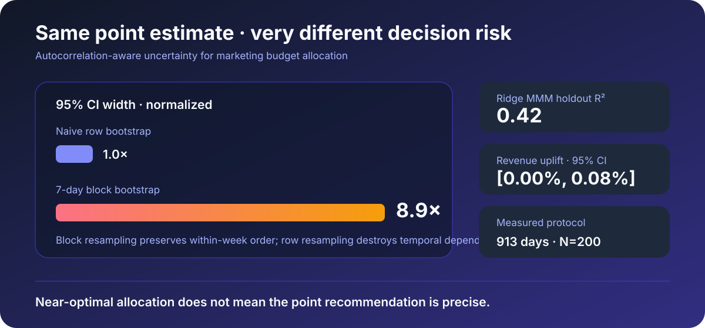
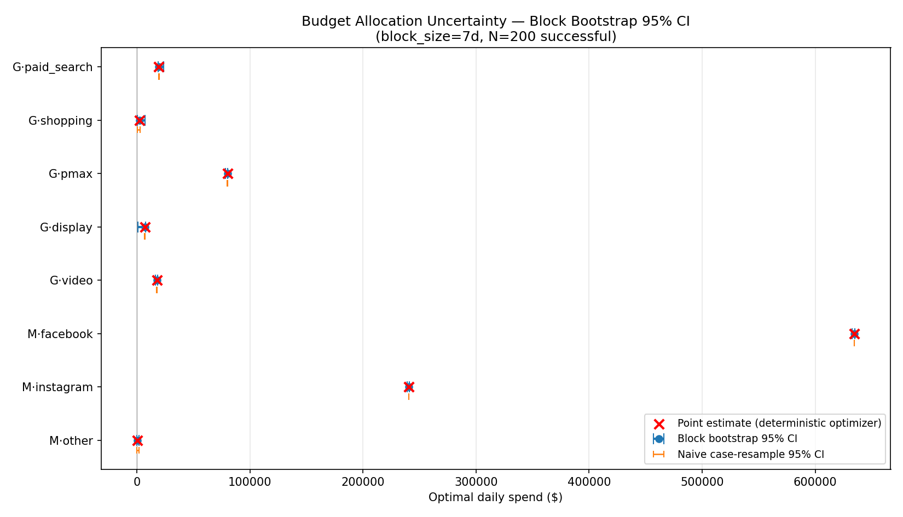
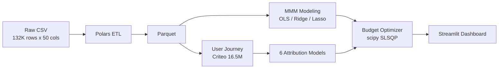

**English** | [中文](README.zh-CN.md)

<p align="center">
  <h1 align="center">Marketing Attribution & Budget Optimization</h1>
  <p align="center">
    <b>A full-stack marketing effectiveness evaluation and budget optimization system — from macro MMM to micro multi-touch attribution</b>
  </p>
  <p align="center">
    <a href="https://github.com/MeaFew/Attributor/actions"></a>
<a href="https://meafew.github.io/attributor/"></a>
    
    
    
  </p>
  <p align="center">
    <a href="./README.zh-CN.md">中文</a> | <b>English</b>
  </p>
</p>

---

## Headline

> **The optimizer's 0% uplift is an honest result, not a failure.** A saturating response model finds the current allocation near a local optimum (point-estimated revenue uplift ≈ **0.0%**), while block bootstrap reveals the real decision risk: its 95% intervals are **8.9× wider** than naive row-wise resampling. The project answers both "how much should we spend?" and "how trustworthy is that number?"

| Evidence | Result |
|----------|--------|
| Ridge MMM holdout R² | **0.42** |
| Revenue-uplift 95% CI | **[0.00%, 0.08%]** |
| Block / naive interval-width ratio | **8.9×** |
| Bootstrap protocol | 913 daily rows · 7-day blocks · N=200 |

<div align="center">
  
</div>

<div align="center">

**Per-channel optimal-budget 95% CIs (single brand · 913 daily rows · block_size=7 days · N=200)**

| Channel | Point estimate | block 95% CI | block/naive width ratio |
|---------|---------------:|--------------|:-----------------------:|
| **meta_facebook** | $634,590 | [$632,850, $635,031] | **9.1×** |
| **meta_instagram** | $240,627 | [$238,886, $241,068] | **9.1×** |
| **google_pmax** | $80,043 | [$78,174, $80,413] | **9.3×** |
| **google_video** | $17,542 | [$16,374, $18,335] | **7.4×** |
| google_paid_search | $19,276 | [$18,703, $23,764] | 14.6× |
| **google_display** ⚠️ | $7,061 | [$706, $7,499] | **17.8×** |
| **google_shopping** ⚠️ | $2,438 | [$244, $7,320] | 3.1× |
| meta_other | $531 | [$52, $1,561] | 1.0× |

> ⚠️ = channels whose interval lower bounds approach 0 and whose coefficient signs are unstable — **the current data does not support strong conclusions for them**.

<details>
<summary><b>📊 Budget CI forest plot (block vs naive 95% CI — the representative block-bootstrap figure)</b></summary>



</details>

</div>

> **Why 8.9× wider**: MMM residuals are strongly autocorrelated (OLS Durbin-Watson = **0.90**; a value of 2.0 would mean no autocorrelation). Naive case resampling resamples row by row, "pretending the samples are independent" — it systematically underestimates uncertainty, yields too-narrow CIs, and gives decision-makers false precision. Block bootstrap cuts the time series into consecutive 7-day blocks and resamples whole blocks with replacement while preserving the within-block order, keeping the autocorrelation structure intact and producing honest (wider) intervals. `tests/test_uncertainty.py::TestBlockVsNaive` proves this directly: on an AR(1)=0.85 series, naive resampling destroys the lag-1 autocorrelation (0.85 → ≈0) while block resampling preserves ≈0.7.

## Overview

This system is built on the figshare "Conjura Multi-Region MMM Dataset" (covering ~100 e-commerce brands, 19 territories, 132,759 daily records from 2019–2024) and delivers a complete analytical pipeline from **macro Marketing Mix Modeling (MMM)** to **micro user journey attribution** to **budget-constrained optimization**.

Core business problems addressed:

- **Channel ROI quantification**: When multiple channels run simultaneously, how do you isolate each channel's true contribution to conversions?
- **Attribution model selection**: First-touch, Last-touch, Shapley Value, and Removal Effect analysis yield vastly different conclusions — how do you systematically compare them?
- **Budget allocation by intuition**: Under a fixed total budget, how do you scientifically reallocate channel spend to maximize revenue?

---

## Architecture



| Layer | Technology | Rationale |
|-------|------------|-----------|
| Data Cleaning | **Polars** | Vectorized execution + lazy evaluation; processes 132K rows in milliseconds |
| Storage | Parquet | Columnar compression, efficient read/write |
| Macro Modeling | **statsmodels** + **scikit-learn** | OLS provides full statistical inference (p-values, confidence intervals); Ridge/Lasso handles channel collinearity |
| Micro Attribution | 6 self-built models | Covers rule-based (First/Last/Linear/Time-decay) and game-theoretic (Shapley/Removal Effect) approaches for head-to-head comparison |
| Budget Optimization | **scipy.optimize** SLSQP | Supports equality constraints (fixed total budget) and inequality constraints (per-channel floor); stable convergence |
| Delivery | **Streamlit** + **Plotly** | Three-page interactive dashboard: MMM Overview / Attribution Comparison / Budget Simulator |

---

## Quick Start

```bash
git clone https://github.com/MeaFew/Attributor.git
cd attributor

# 1. Create and activate a Python 3.11 virtual environment
python -m venv .venv
# Linux / macOS: source .venv/bin/activate
# Windows PowerShell: .venv\Scripts\Activate.ps1

# 2. Install locked dependencies, the package, and development tools
make setup
# Windows without GNU Make: python -m pip install -r requirements.lock
#                           python -m pip install -e ".[dev]"

# 3. Download MMM dataset (GitHub Releases, ~31MB)
bash download_data.sh

# 4. (Optional but recommended) Download real attribution dataset
#    Criteo Attribution Modeling for Bidding Dataset (~623MB)
#    Place at data/raw/criteo_attribution_dataset.tsv.gz
#    Official: https://ailab.criteo.com/criteo-attribution-modeling-bidding-dataset/

make all          # Run full pipeline: clean -> MMM -> attribution -> optimize
                  # Attribution step auto-detects: real preprocess_criteo when the
                  # Criteo raw TSV exists, else falls back to generate_touchpoints
                  # synthetic data (same behavior as run_all.py)
python -m attributor.budget_uncertainty  # reproduce the block-bootstrap intervals above
make dashboard    # Launch Streamlit interactive dashboard
make verify       # Local quality gates (lint + format + test + audit)
```

---

## Core Modules

### 1. Data Preprocessing (`src/attributor/preprocess.py`)

```
Input:  132,759 rows x 50 cols (heavy nulls + thousand-separator commas)
Output: Cleaned Parquet (daily granularity)
Key operations:
  - Thousand-separator removal + Float64 coercion (fixes Polars auto-inferring String)
  - CTR, CPM, ROAS derived metric calculation
  - Adstock decay feature construction: x_t + 0.5*x_{t-1} + 0.25*x_{t-3} + 0.125*x_{t-7}
  - Temporal feature extraction (year/month/day_of_week/is_weekend)
```

### 2. Marketing Mix Modeling (`src/attributor/mmm_model.py`)

**Leakage & regularization notes (important):**
- **Chronological split, not random**: MMM is a daily time series; an earlier version fit on all rows and reported R², which is resubstitution (in-sample). We now hold out the last 20% by date and report both in-sample R² and holdout R²/MAE so the generalization gap is visible.
- **Standardized Ridge/Lasso + CV alpha**: an earlier version applied tiny alphas (1.0/0.1) on **unscaled** features, so Ridge/Lasso coefficients were nearly identical to OLS (one model dressed as three). We now `StandardScaler` the features and select alpha via `TimeSeriesSplit` over a log grid (Ridge logspace(-3,3), Lasso logspace(-3,1)) so the shrinkage is real and the three models genuinely differ.

**Benchmark:** the Conjura MMM Dataset (released June 2024) is an academic dataset with no official competition baseline; the following are standard modeling reference points in MMM practice:

| Reference | R² | Adj. R² | Notes |
|-----------|-----|---------|-------|
| **MMM domain benchmark (Ridge)** | 0.70–0.85 | — | Brand-level MMM with full promotion/price/competitor data (ref: Hanssens et al., *Market Response Models*, 2nd ed.) |
| **Naive mean predictor** | ~0.0 | — | Predicts the historical revenue mean |
| **Single variable (largest channel)** | ~0.35 | — | Regression on the single highest-spend channel only |
| **This project OLS (in-sample / holdout)** | 0.542 / 0.440 | 0.536 | Single-brand all-channel linear regression (auto-selected brand=5488b0, 183-day chronological holdout) |
| **This project Ridge (in-sample / holdout)** | 0.342 / 0.419 | — | L2 regularization, standardized + CV-selected alpha=1000 |
| **This project Lasso (in-sample / holdout)** | 0.542 / 0.440 | — | L1 regularization, standardized + CV-selected alpha=10 |

| Model | R² (in-sample) | R² (holdout) | MAE (holdout) | Best Regularization |
|-------|-----|---------|---------|---------------------|
| OLS | 0.542 | 0.440 | 1,816,109 | — |
| **Ridge** | 0.342 | 0.419 | 1,812,313 | alpha = 1000 (CV) |
| Lasso | 0.542 | 0.440 | 1,816,124 | alpha = 10 (CV) |

> Ridge, under the CV-selected large alpha, visibly shrinks coefficients (in-sample R² drops to 0.342 while holdout R² 0.419 stays close to OLS's 0.440) — strong regularization trades a little bias for much more stable coefficients, which matters for out-of-sample budget extrapolation. Lasso selects alpha=10 but zeroes no coefficient (every spend variable is informative). R² ~ 0.54 (in-sample) / 0.44 (holdout) reflects the natural ceiling of aggregate MMM without price/promotion/competitor data; brand-level models can reach 0.70–0.85. Diagnostics such as Durbin-Watson are emitted by the model; see `data/processed/models/mmm_results.json`.

### 3. Multi-Touch Attribution (`src/attributor/multi_touch_attribution.py`)

Uses the real **Criteo Attribution Modeling for Bidding Dataset** (30 days of live traffic, approximately 16.5M impressions and 45K conversions). Impression-level data is aggregated by `uid` into user journeys. The Top 10 campaigns are kept as individual channels; the remaining 665 campaigns are grouped into an `other` bucket. Five attribution models plus removal effect analysis are compared:

| Channel | First-Touch | Last-Touch | Linear | Time-Decay | **Shapley** | **Removal Eff.** |
|---------|:-----------:|:----------:|:------:|:----------:|:-----------:|:----------:|
| campaign_10341182 | 4.2% | 5.1% | 4.2% | 5.0% | **4.2%** | **16.9%** |
| campaign_9100693 | 3.2% | 4.7% | 5.3% | 4.4% | **3.3%** | **19.4%** |
| campaign_15184511 | 3.3% | 3.2% | 2.7% | 3.2% | **3.2%** | **16.1%** |
| campaign_30801593 | 3.0% | 3.0% | 3.2% | 2.9% | **2.9%** | **1.1%** |
| campaign_32368244 | 2.4% | 2.9% | 2.4% | 2.8% | **2.4%** | **13.3%** |
| campaign_15398570 | 2.2% | 2.2% | 1.7% | 2.2% | **2.3%** | **5.8%** |
| campaign_29427842 | 1.6% | 1.7% | 1.6% | 1.7% | **1.9%** | **6.5%** |
| campaign_2869134 | 1.9% | 2.9% | 3.5% | 2.7% | **1.9%** | **12.0%** |
| campaign_31772643 | 1.2% | 1.1% | 0.8% | 1.1% | **1.3%** | **5.4%** |
| campaign_28351001 | 1.3% | 1.1% | 0.8% | 1.1% | **1.3%** | **3.5%** |
| **other** | **75.7%** | **72.0%** | **73.7%** | **73.0%** | **75.5%** | **0.0%** |

> Note: Campaign IDs are anonymized Criteo campaign IDs. `other` aggregates the 665 long-tail campaigns outside the Top 10, so it dominates impressions and conversions.

**Key Findings:**

- **Rule-based models (First/Last/Linear/Time-Decay)** are highly consistent on real data: because the `other` bucket covers the vast majority of impressions, all rule-based models assign it 72%–76% of attribution credit.
- **Shapley Value** still provides the most stable allocation on real data. The Top 3 channels (campaign_10341182, campaign_9100693, campaign_15184511) contribute ~11% combined, consistent with rule-based models.
- **Removal Effect** is insensitive to the `other` bucket (removing `other` leaves almost no sample, driving its share to 0%), but it is highly sensitive to individual top campaigns — campaign_9100693 and campaign_10341182 show removal effects of 19.4% and 16.9%, respectively, indicating they have the largest marginal impact on overall conversion rate.
- **Methodological insight**: On real data, differences between attribution models are smaller than on simulated data (because the `other` bucket dominates), but Shapley and Removal Effect still effectively identify the highest-impact campaigns.

### 4. Budget Optimization (`src/attributor/budget_optimizer.py`)

Uses Ridge MMM coefficients as the asymptotic ceiling of a **saturating channel response function**, with SLSQP solving for optimal allocation under a fixed total budget:

**Response model (saturating, not linear):**

```
revenue_i = coef_i · spend_i^gamma / (spend_i^gamma + tau_i^gamma)
```

where `coef_i` is the Ridge elasticity, `gamma=1.5` the Hill slope, and `tau_i` (half-saturation) is anchored at the channel's current average spend — so the model agrees with the linear elasticity near the observed operating point but bends over (diminishing returns) as spend grows well beyond `tau_i`.

| Scenario | Total Budget | Predicted Revenue (current → optimal) | Uplift |
|----------|-------------|-------------------|--------|
| Current Allocation (Baseline) | 100% | $2,082,150 → — | — |
| **Re-optimized Allocation** | 100% | $2,082,150 → $2,082,159 | **≈ 0.0%** |
| Budget +10% + optimization | 110% | $2,082,150 → $2,082,159 | ≈ 0.0% |
| Budget +20% + optimization | 120% | $2,082,150 → $2,082,157 | ≈ 0.0% |
| Budget -10% + optimization | 90% | $2,082,150 → $2,082,160 | ≈ 0.0% |

> **Honest business insight**: an earlier version used a **linear** response function, under which the budget-constrained optimum degenerates to a trivial greedy corner solution — push all budget to the highest-elasticity channel and extrapolate far outside the training spend range, yielding a fictitious +1.8% uplift (a linear model implies unbounded returns to scale and cannot support budget guidance). With a saturating response, at this brand's current operating point (each channel already near its own `tau`) reallocation yields essentially no extra revenue (≈0%) and incremental budget's marginal return is naturally capped — which is the honest conclusion a budget optimizer should deliver: **the current allocation is already near a local optimum**. Unlocking real optimization headroom requires stronger features (price, promotion, competitor spend) or finer modeling (sub-channel / daypart).

### 5. Budget Uncertainty (`src/attributor/budget_uncertainty.py`)

> A single point estimate can be dangerous. The optimizer in Section 4 outputs a single number — "google_video should spend $17,542" — and a CMO acting on it implicitly assumes the optimal allocation is known exactly. But the Ridge coefficients are noisy and the training window is only a slice of history; the point estimate hides real decision risk. This section attaches **95% confidence intervals** to every channel's optimal spend and to the revenue uplift, upgrading the project from "can optimize" to "understands decision risk".

**Method: block bootstrap (and why not naive bootstrap).** Naive case resampling (row-wise resampling with replacement) assumes i.i.d. samples, but the MMM residuals are strongly autocorrelated — OLS Durbin-Watson = **0.90** (2.0 would mean no autocorrelation). Row-wise resampling under such dependence "pretends the samples are independent", systematically underestimating uncertainty and producing too-narrow CIs. Block bootstrap cuts the series into consecutive blocks (7 days by default) and resamples whole blocks with replacement while preserving the original within-block order — the within-block autocorrelation survives, so the intervals are honest.

```
naive case-resample          block bootstrap
┌─────────────────┐          ┌──┬──┬──┬──┬──┐   split series into blocks
│ shuffles time   │          └──┴──┴──┴──┴──┘
│ pretends i.i.d. │    vs.   ┌──┐┌──┐┌──┐┌──┐   resample whole blocks
│ → CI too narrow │          │  ││  ││  ││  │   keep order within block
│ → false precision│         └──┘└──┘└──┘└──┘
└─────────────────┘          → honest (wider) CI
```

This is not rigor theater — the naive method is simply wrong here. `tests/test_uncertainty.py::TestBlockVsNaive` proves it directly: on an AR(1)=0.85 autocorrelated series, block resampling preserves lag-1 autocorrelation at ≈0.7 while naive resampling collapses it to ≈0. On the measured run (N=200), the block intervals are **8.9× wider** on average and the revenue-uplift interval is **[0.00%, 0.08%]**, making coefficient instability and decision risk explicit.

**Honest interpretation — which conclusions are trustworthy:**

- **Stable estimates** (narrow CI relative to the point estimate): `meta_facebook`, `meta_instagram`, `google_pmax` — large current spend (hundreds of thousands), already near their saturation points, and the optimal allocation barely moves across bootstrap resamples. For these three channels the point estimate is decision-grade.
- **Uncertain estimates** (very wide CI, lower bound near 0): `google_display` (CI [$706, $7,499]) and `google_shopping` (CI [$244, $7,320]). Honestly: the current data does not support strong conclusions for these two channels. Their Ridge coefficient signs are themselves unstable (display's OLS coefficient has p=0.31, not significant), so the optimizer oscillates between "cut" and "grow" and the CI spans nearly the whole allowed range. Cutting these budgets on the point estimate alone is risky — more data (a longer window, price/promotion features) or finer granularity is needed first.
- The **block/naive width ratio** shows naive resampling would underestimate these CIs by 7–18×: the higher the ratio, the more that channel's uncertainty is dominated by autocorrelation.

A wide CI is not a model failure — it honestly reflects the information content of the data, and is itself a valuable decision input ("this channel's conclusion is uncertain; don't touch it yet").

**Configuration** (centralized in `config.py`, single point of change): `BLOCK_SIZE_DAYS=7`, `N_BOOTSTRAP=200`, `BOOTSTRAP_CI_LEVEL=0.95`, `BOOTSTRAP_RANDOM_SEED=42`. The module reuses rather than duplicates `mmm_model.fit_ridge` / `prepare_features` / `chronological_split` and `budget_optimizer.optimize_budget` / `extract_params` / `load_mmm_results`.

---

## Project Structure

```
attributor/
├── src/attributor/
│   ├── preprocess.py              # Polars ETL: nulls, thousand-separator handling, adstock, derived metrics
│   ├── mmm_model.py               # OLS + Ridge + Lasso, VIF / Durbin-Watson / residual diagnostics
│   ├── generate_touchpoints.py    # Simulate 50K user journeys based on real channel structure (fallback)
│   ├── preprocess_criteo.py       # Aggregate Criteo impression data into user journeys
│   ├── multi_touch_attribution.py # 6 attribution models: First / Last / Linear / Time-decay / Shapley / Removal Effect
│   ├── budget_optimizer.py        # scipy.optimize SLSQP budget-constrained optimization (saturating Hill response)
│   └── budget_uncertainty.py      # block-bootstrap 95% confidence intervals for optimal spend (uncertainty quantification)
├── notebooks/
│   └── 01_eda.ipynb               # Exploratory data analysis
├── dashboard/
│   └── app.py                     # Streamlit three-page interactive dashboard
├── tests/
│   ├── test_algorithms.py         # Algorithm unit tests: 6 attribution models (incl. Shapley correctness) + 3 MMM models + budget optimizer
│   ├── test_core_modules.py       # Extended edge-case tests: MMM fitting, Shapley, SLSQP optimizer
│   ├── test_preprocess.py         # Data cleaning unit tests
│   ├── test_mmm.py                # Model output format and statistic tests
│   ├── test_uncertainty.py        # Block bootstrap uncertainty: block logic / CI coverage / block vs naive comparison
│   └── test_attribution.py        # Attribution normalization and boundary condition tests
├── data/
│   ├── raw/                       # Conjura MMM dataset (figshare)
│   └── processed/                 # Cleaned Parquet
├── reports/
│   └── images/                    # Generated charts
├── Makefile                       # Workflow orchestration
├── requirements.lock              # Reproducible dependency pins
└── .github/workflows/ci.yml       # GitHub Actions: lint + test + docker-build
```

---

## Limitations & Production Path

| Limitation | Current Approach | Production Path |
|------------|-----------------|-----------------|
| Multi-touch attribution uses real Criteo data, but campaigns are aggregated | Top 10 campaigns + `other` bucket (665 campaigns) to keep Shapley computation tractable | Integrate directly with CDP/Segment/Tealium for complete, unaggregated user journeys; or use more compute to handle all campaigns |
| MMM is daily granularity | Original daily data provides reasonable temporal resolution | Introduce hour-of-day or daypart features for further refinement |
| No competitive environment variables | Model assumes constant market share | Incorporate competitor spend data (e.g., Pathmatics, Sensor Tower) |
| Single-node execution | Local Parquet | Migrate to Snowflake/BigQuery + dbt pipeline orchestration |
| Budget optimization is static | One-time solve, no dynamic budget adjustment | Reinforcement learning (PPO / MADDPG) for real-time budget bidding |

---

## Related Projects

| Project | Repo | Description |
|---------|------|-------------|
| E-commerce User Analytics | [MeaFew/shoplytics](https://github.com/MeaFew/Shoplytics) | 29M real user behavior records, 10 analytical modules |
| Credit Risk Scoring | [MeaFew/riskscore](https://github.com/MeaFew/RiskScore) | WOE/IV + XGBoost/LightGBM + SHAP interpretability |
| Multivariate Time Series | [MeaFew/foresight](https://github.com/MeaFew/Foresight) | LSTM / Transformer / XGBoost forecasting benchmarks |
| Graph Fraud Detection | *planned* | GNN illicit transaction detection (Elliptic) |

## License

Code is released under MIT License. Dataset sourced from the publicly available Conjura MMM Dataset on figshare, subject to its usage terms.
